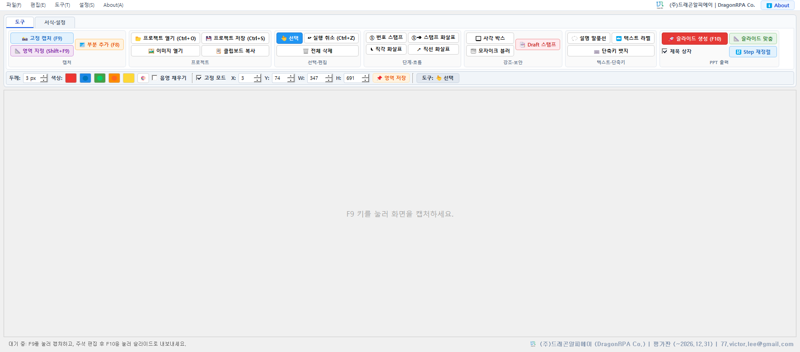
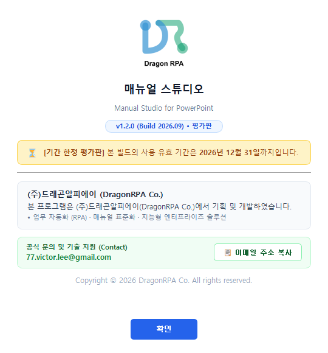

# 매뉴얼 스튜디오 (Manual Studio for PowerPoint)

업무매뉴얼 제작을 위해 반복되는 화면 캡처, 리사이즈, 번호 스탬프 그리기, PPT 붙여넣기 작업을 단축키 `F9`와 `F10`으로 원스톱 처리하는 윈도우 전용 도구입니다.

---

## 🚀 빠른 시작 방법

1. **실행**: `run.bat` 파일을 더블클릭합니다.
2. **단축키**:
   - `F9`: **고정 영역 즉시 캡처** (화면 오버레이 없이 지정된 좌표를 0.01초 만에 즉시 캡처)
   - `Shift + F9`: **새 영역 드래그 지정** (화면에서 원하는 영역을 드래그하여 지정, 완료 즉시 새 고정 영역으로 자동 등록)
   - `F10`: **파워포인트 슬라이드로 내보내기** (새 슬라이드 자동 생성 + 클립보드 복사)

---

## 🎯 핵심 기능 및 신규 편의 기능

### 1. 📌 고정 영역(Rect) 자동 기억 & 즉시 캡처 워크플로우 (대폭 강화!)
- **배경**: 동일한 위치에서 메뉴/탭 화면만 연속으로 바뀔 때, 매번 영역을 드래그할 필요 없이 즉시 캡처.
- **스마트 자동화 워크플로우**:
  1. `Shift+F9` (또는 툴바의 `[📐 영역 지정]`)를 눌러 화면에서 원하는 영역을 마우스로 드래그하여 캡처합니다.
  2. **드래그 완료 즉시 해당 좌표와 크기가 고정값으로 자동 등록**되며, 고정 영역 모드가 자동으로 활성화됩니다!
  3. 이제 다음 창/화면으로 이동한 뒤 **`F9`만 누르면 오버레이 드래그 화면 없이 방금 지정한 영역 그대로 즉시 찰칵 캡처**되어 스튜디오로 들어옵니다!
  4. 다른 새로운 영역을 지정하고 싶을 때는 언제든 **`Shift+F9`**를 누르면 새 영역을 다시 드래그할 수 있습니다.
  5. 툴바의 `X, Y, W, H` 스핀박스를 직접 수정하거나 `[📌 현재 영역 저장]` 버튼을 눌러도 즉시 고정 영역으로 활성화됩니다.

### 2. 🎨 색상 선택 가능한 박스 개체 (신규!)
- **다양한 프리셋 컬러**: 🔴 빨강, 🔵 파랑, 🟢 초록, 🟠 주황, 🟡 노랑 및 🎨 커스텀 컬러 지원.
- **반투명 음영 채우기**: `[반투명 음영 채우기]` 체크 시 박스 내부가 은은하게 채워져 특정 영역을 강조(Highlight)할 때 매우 편리합니다.
- **자유 조작**: 생성된 박스는 `선택/이동` 모드에서 마우스 드래그로 위치를 자유롭게 이동할 수 있으며, 색상 버튼을 누르면 선택된 박스의 색상이 즉시 변경됩니다. 우클릭 시 삭제됩니다.

### 3. 🎀 리본 메뉴(Ribbon Bar) & 상시 퀵 서식 바
- **2-Tab 오피스/Snagit 스타일 리본 구조**:
  - **탭 1 `도구`**:
    - `[캡처]`: 📸 고정 캡처 (F9), 📐 영역 지정 (Shift+F9), 📂 파일 열기, 📋 클립보드 복사
    - `[선택·편집]`: 👆 선택, ↩ 실행 취소 (Ctrl+Z), 🗑 전체 삭제
    - `[단계·흐름]`: ① 번호 스탬프, ①➔ 스탬프 화살표, ↳ 직각 화살표, ↗ 직선 화살표
    - `[강조·보안]`: 🔲 사각 박스, 🌫 모자이크 블러
    - `[텍스트·단축키]`: 💬 설명 말풍선, 🔤 텍스트 라벨, ⌨ 단축키 뱃지
    - `[PPT 출력]`: 🚀 슬라이드 생성 (F10), 📐 슬라이드 맞춤, ☑ 제목 상자
  - **탭 2 `서식·설정`**:
    - `[스탬프]`: 크기(px), 배경색, ①번 리셋
    - `[선·화살표]`: 선 두께(px), 촉 크기(px), 음영 채우기
    - `[텍스트·말풍선]`: 글꼴 크기(pt), 글자색, 배경색, 꼬리 너비(px)
    - `[보안·단축키]`: 모자이크 블록 크기(px), 단축키 글꼴 크기(pt)
    - `[PPT 규격·배치]`: 가로폭(px), Left(pt), Top(pt), 배율(%)
    - `[환경설정]`: ⚙ 상세 설정 다이얼로그
  - **하단 상시 퀵 서식 바 (Quick Format Strip)**:
    - 선 두께 스핀박스 (1~20px)
    - 색상 프리셋 버튼군 (🔴, 🔵, 🟢, 🟠, 🟡, 🎨 커스텀)
    - 음영 채우기 체크박스
    - 고정 모드 토글 체크박스 및 좌표 스핀박스 (X, Y, W, H)
    - 📌 영역 저장 버튼
    - 실시간 도구/선택 객체 상태 뱃지 표시

---

## 🎨 5대 추천 매뉴얼 주석 기능 (신규!)

1. **`①➔` 스탬프 화살표 (Step Arrow)**:
   - 스탬프 번호 뱃지와 지시 화살표가 일체형으로 결합된 도구입니다.
   - 드래그 시작점에 스탬프가 찍히고 드래그 끝점에 화살표 촉이 위치하여 "이 버튼을 눌러라"는 동작 지시를 1회 드래그로 완결합니다.
   - `StampItem`과 번호가 유기적으로 공유되어 `① ➔ ② ➔ ③` 순서로 연속 증가합니다.

2. **`↳` 직각 꺾은선 화살표 (Elbow Arrow)**:
   - 수평-수직(HV)으로 직각 꺾이는 지시선 화살표입니다.
   - 툴바 메뉴 트리, 팝업 옵션, 서브 메뉴 단계를 화면을 가리지 않고 정갈하게 우회하여 가리킬 때 최적입니다.

3. **`💬` 지시선 말풍선 (Callout Box)**:
   - 대상 UI를 뾰족한 삼각형 꼬리로 정확히 가리키는 둥근 설명 상자입니다.
   - 더블클릭하여 언제든 설명을 인라인 수정할 수 있으며, 박스 크기와 위치가 스마트하게 렌더링됩니다.

4. **`🌫` 비파괴 모자이크 블러 (Non-Destructive Blur Mosaic)**:
   - 개인정보, 고객명, 계좌번호, 금액, 비밀번호 등을 가려주는 모자이크 필터입니다.
   - 원본 비트맵을 영구 훼손하지 않는 오버레이 객체이므로 언제든 위치 이동, 크기 조절, `Ctrl+Z` 취소, 삭제가 가능합니다.

5. **`⌨` 3D 키캡 단축키 뱃지 (Hotkey Badge)**:
   - `Enter ↵`, `Ctrl+C`, `Shift+F9` 등 매뉴얼에 필수적인 키보드 단축키를 실물 키캡처럼 입체 음영과 베벨을 살려 표시합니다.
   - 더블클릭 시 프리셋 키(Enter, Tab, Esc, Ctrl+S 등) 선택 및 자유 텍스트 입력이 가능합니다.

---

### 4. 📂 프로젝트 분리 보존 및 3종 세트 자동 저장 (.mcs.json & Re-edit)
- **문제 해결**: 매뉴얼 사후 수정 시 캡처부터 모든 주석 작업을 다시 해야 했던 문제를 100% 원천 해결.
- **F10 슬라이드 내보내기 시 3종 세트 동시 자동 저장**:
  1. `Step_NNN.png`: PPT 슬라이드 전송 및 클립보드 복사용 일체형 완성 이미지 (Bake).
  2. `Step_NNN_raw.png`: 주석이 전혀 그려지지 않은 순수 바탕 화면 캡처 원본.
  3. `Step_NNN.mcs.json`: 개별 객체 레이어가 모두 살아있는 스튜디오 재수정용 프로젝트 파일.
- **프로젝트 열기 (`Ctrl+O`) & 재편집**:
  - 기존 작업한 `.mcs.json`을 열면 원본 캡처 위에 과거 주석들이 **완전히 편집 가능한 라이브 객체로 1:1 복원**.
  - 스탬프나 화살표를 드래그 이동하거나 말풍선 텍스트를 고친 후 `F10`을 누르면 슬라이드와 프로젝트 파일이 최신 상태로 갱신됩니다.
- **스마트 번호 자동 재정렬 (Auto Re-indexing)**:
  - `①`, `②`, `③`, `④` 작업 중 중간의 `②`번을 삭제(`Delete` 키 또는 우클릭)하면 뒤의 번호들이 `②`, `③`으로 자동 당겨져 번호가 꼬이지 않습니다.
- **단축키**:
  - `Ctrl + O`: 프로젝트 열기
  - `Ctrl + S`: 프로젝트 저장
  - `Delete` / `Backspace`: 선택된 주석 객체 즉시 삭제
  - `Ctrl + Z`: 실행 취소 (삭제 복원 포함)

---

### 5. 📐 규격화 및 슬라이드 내보내기 (`F10`)
- **PPT 가로폭 자동 정규화**: 지정한 해상도(기본 `960px`)로 Lanczos 고화질 자동 리사이즈.
- **파워포인트 자동 생성**: 열려 있는 PPT 파일의 새 슬라이드에 정중앙 자동 배치 (`Step N` 제목 상자 포함, 첫장 표지 감안하여 슬라이드 번호 - 1 자동 보정).
- **클립보드 동시 복사**: 윈도우 네이티브 DIB 포맷으로 복사되어 어디서나 `Ctrl + V` 가능.
- **자동 3종 백업**: `captures_YYYYMMDD/` 폴더에 일체형 이미지 + 원본 비트맵 + 프로젝트 파일 동시 저장.

---

### 6. 🏢 개발사 정보 및 About (DragonRPA Co.)
- **개발/제작**: (주)드래곤알피에이 (DragonRPA Co.)
- **공식 CI 및 브랜딩 탑재**:
  - 프로그램 윈도우 타이틀바, 메뉴바 우측 상단 코너, 하단 상태바에 공식 CI 및 회사명 표시.
  - 메뉴 오른쪽 끝에 **`About`** 버튼 및 메뉴 항목 탑재.
- **About 다이얼로그**:
  - 공식 CI 로고 및 소프트웨어 버전(`v1.2.0`) 표시.
  - 기간 한정 평가판 안내 카드 (`~2026년 12월 31일`).
  - 개발사 안내: `(주)드래곤알피에이 (DragonRPA Co.)`
  - 고객 문의 및 기술 지원(Contact): `77.victor.lee@gmail.com`
  - 원클릭 `[📋 이메일 주소 복사]` 지원.

  

---

### 7. 📜 소프트웨어 최종 사용자 사용권 계약서 (EULA)
- **저작권 및 지식재산권**: (주)드래곤알피에이 (DragonRPA Co., Ltd.) 배타적 소유.
- **사용권 범위**:
  - 기간 한정 평가판: 2026년 12월 31일까지 비상업적/평가 목적 무상 사용.
  - 상용 라이선스: 1PC-1License Node-Lock (단일 하드웨어 식별자 귀속).
- **보호 및 제약 사항**: 리버스 엔지니어링, 역어셈블, 디컴파일, HWID/시계 변조, 무단 재배포 엄격 금지 (위약벌 및 손해배상 청구권 명시).
- **전문 확인**: [EULA 전문 (EULA.md)](EULA.md) 및 프로그램 내 `EULA(&E)` 메뉴 / 공식 웹사이트 [Manual Studio EULA](https://www.dragonrpa.co.kr/manual-studio) 참조.

---

### 8. 🌐 글로벌 9개 국어 I18N 다국어 지원 & 가이드 문서
- **전 세계 9개 핵심 언어권 완벽 지원**:
  - 한국어(`ko`), English(`en`), 简体中文(`zh`), 日本語(`ja`), Deutsch(`de`), Español(`es`), Français(`fr`), Português(`pt`), Русский(`ru`).
  - Windows OS 기본 언어 자동 감지 및 실시간 언어 전환(`🌐 언어(Language)` 메뉴).
  - 한자, 히라가나/가타카나, 키릴 문자 깨짐 방지를 위한 글로벌 폴백 폰트 체인(`Segoe UI`, `Microsoft YaHei`, `Yu Gothic`, `Meiryo`, `Malgun Gothic`, `Arial`) 탑재.
- **언어별 공식 사용자 가이드 번들 (`docs/`)**:
  - [한국어 가이드](docs/User_Guide_KO.md) | [English Guide](docs/User_Guide_EN.md) | [简体中文指南](docs/User_Guide_ZH.md) | [日本語ガイド](docs/User_Guide_JA.md)
  - [Deutsch Handbuch](docs/User_Guide_DE.md) | [Guía en Español](docs/User_Guide_ES.md) | [Guide en Français](docs/User_Guide_FR.md) | [Guia em Português](docs/User_Guide_PT.md) | [Руководство пользователя](docs/User_Guide_RU.md)

---

### 9. 🔑 엔터프라이즈 라이선스 엔진, 키젠(발급기) & 워터마크 정책
- **6대 라이선스 에디션 구분**:
  - 1카피 영구(`MS1P`), 1개월 구독(`MS1M`), 1년 연간 구독(`MS1Y`), 볼륨/엔터프라이즈(`MSENT`), 오프라인 폐쇄망 사이트(`MSSITE`), 14일 평가 연장(`MST14`).
- **HMAC-SHA256 보안 & HWID 노드락 바인딩**:
  - 클라이언트 고유 머신 식별자(`DRPA-XXXX-XXXX-XXXX`) 기반 위변조 불가능한 암호화 서명.
- **워터마크 제어**:
  - 미인증 평가판 상태에서는 PPT 생성 및 클립보드 복사 시 반투명 'Manual Studio' 워터마크 자동 삽입.
  - 정식 라이선스 인증 시 워터마크 100% 영구 제거 및 무제한 고해상도 출력 허용.
- **독립형 라이선스 발급기 (`tools/keygen_manual_studio.py`)**:
  - 관리자/영업용 GUI 및 CLI 라이선스 발급 도구 제공.

---

### 10. 📊 사내 PPT 마스터 템플릿 연동 & 실수 방지 자동 저장
- **사내 PPT 마스터 템플릿(`.pptx`, `.potx`) 지정**:
  - 환경 설정에서 사내 공식 마스터 파일을 지정하면 회사 로고, 배경 디자인, 슬라이드 서식이 100% 자동 상속.
- **실수 방지 주기적 자동 저장(Auto-save) & 재실행 복구**:
  - 1~30분 주기 백그라운드 자동 저장 및 PC 비정상 종료 시 재실행 원클릭 100% 무손실 복구.
- **엔터키 대기 없는 즉시 캡처**:
  - `Shift+F9`(영역 지정) 및 `F8`(추가 캡처) 드래그 완료 즉시(마우스 릴리즈) 캔버스에 즉각 안착.

---

### 11. 🚀 스마트 자동 업데이트 (Smart Auto-Updater)
- **GitHub CDN 기반 초고속 무제한 버전 검증**:
  - `raw.githubusercontent.com/.../version.json`을 통한 Rate-limit 없는 비동기 버전 확인 및 릴리즈 노트 자동 수신.
- **원자적 파일 교체 & 자동 재실행 (`WindowsPatcher`)**:
  - Windows 파일 락을 안전하게 우회하여 현재 구동 프로세스 종료 대기 후 새 바이너리 원자적 교체 및 재시작.
- **라이선스 및 설정 100% 영구 상속**:
  - 바이너리 업데이트 후에도 기존 레지스트리 라이선스(`HKCU\Software\DragonRPA\ManualStudio\License`)와 개인 설정(`config.json`) 무손실 보존.
- **인앱 메뉴 & 백그라운드 자동 확인**:
  - 메뉴바 `도움말(&H) -> 🚀 최신 업데이트 확인(&U)...` 및 앱 구동 3.5초 후 자동 버전 체크 지원.
