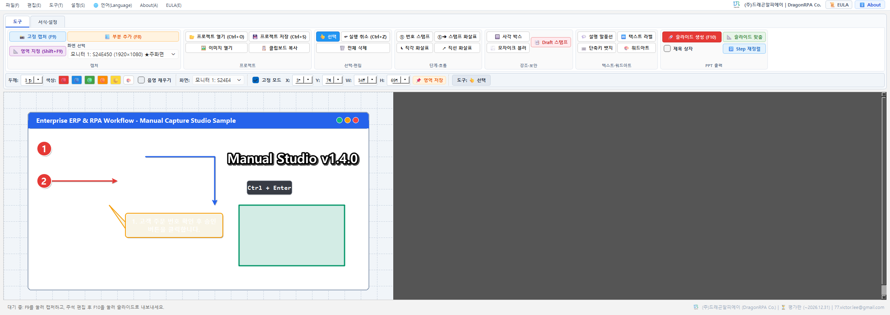
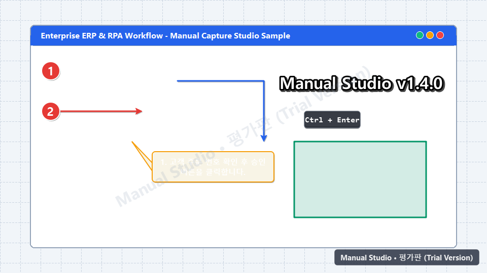
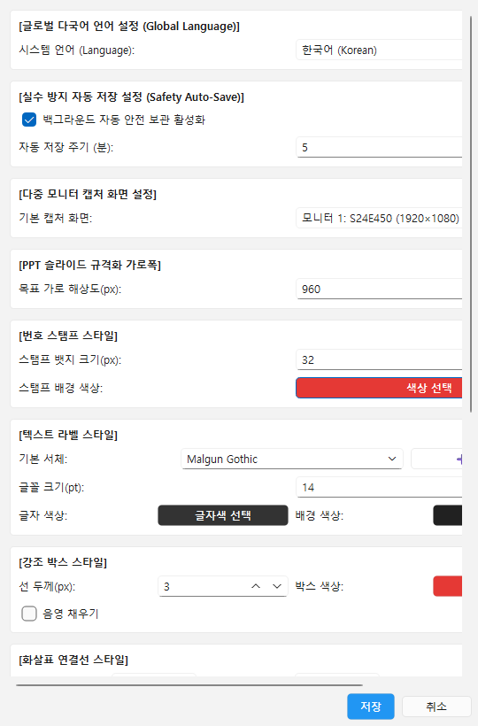
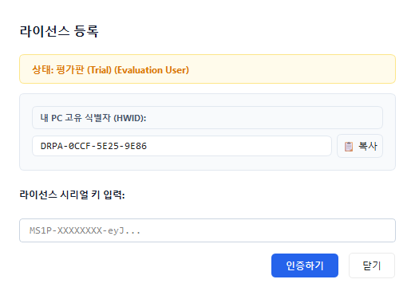

# 매뉴얼 스튜디오(Manual Studio) v1.4.0 사용자 가이드
> **파워포인트 매뉴얼 제작 전문 자동화 솔루션 • (주)드래곤알피에이**
> *Official Release Build v1.4.0 | (주)드래곤알피에이 (DragonRPA Co., Ltd.)*

---

## 📌 1. 핵심 주요 기능
매뉴얼 스튜디오는 화면 캡처부터 10종의 전문 주석 삽입, 사내 PPT 마스터 템플릿 연동, 그리고 파워포인트 슬라이드 자동 생성까지 원클릭으로 완결하는 엔터프라이즈 업무 표준화 소프트웨어입니다.

---

## ⚡ 2. 단축키 및 즉시 캡처

| 단축키 | 기능 명칭 | 상세 설명 |
| :--- | :--- | :--- |
| **`F9`** | 고정 좌표 캡처 | 설정된 좌표/크기로 즉시 캡처하여 캔버스에 안착 |
| **`Shift + F9`** | 영역 지정 캡처 | 마우스 드래그 후 릴리즈 즉시 확정 (엔터 입력 대기 없음) |
| **`F8`** | 부분 추가 캡처 | 캔버스 작업 중 화면 일부를 추가 캡처하여 오버레이 스티커로 부착 |
| **`F10`** | PPT 슬라이드 생성 | 열려 있는 PPT에 새 슬라이드 생성, 이미지 정밀 삽입 및 클립보드 복사 |
| **`Ctrl + S`** | 프로젝트 저장 | 비트맵 원본과 주석 벡터 데이터를 무손실 `.mcs.json`으로 영구 보존 |
| **`Ctrl + Z`** | 실행 취소 | 직전 주석 편집 조작을 안전하게 롤백 |

> **Tip**: Shift+F9 또는 F8 캡처 시, 마우스 드래그를 마치고 손을 떼는 순간(Mouse Release) 엔터키 입력 대기 없이 즉시 확정되어 캔버스에 안착됩니다.

---

## 🎨 3. 10대 전문 주석 및 도구 모음

1. **① 번호 스탬프**: 클릭할 때마다 1부터 순차 증가하는 원형 스탬프 (크기/색상 자유 조정)
2. **①➔ 스탬프 화살표**: 시작점에 번호 스탬프가 달린 일체형 가이드 화살표
3. **↳ 직각 엘보 화살표**: 복잡한 UI 요소를 우회하여 안내하는 직각 꺾임 화살표 (Tab키로 수평/수직 경로 전환)
4. **↗ 직선 화살표**: 정밀한 방향성을 제시하는 표준 벡터 화살표
5. **🔲 사각 박스**: 중요한 메뉴나 입력 필드를 강조하는 테두리/반투명 채우기 상자
6. **🌫 모자이크 블러**: 고객 개인정보, 계좌번호, 비밀번호 등을 마우스 드래그로 즉시 마스킹
7. **💬 설명 말풍선**: 꼬리 방향을 자유롭게 조절할 수 있는 라운드 사각 설명 상자
8. **🔤 텍스트 라벨**: 맑은 고딕, Segoe UI 등 전 세계 다국어 글꼴을 지원하는 깔끔한 텍스트
9. **⌨ 단축키 뱃지**: `Ctrl+C`, `Alt+F4` 등 키보드 키 캡 모양의 입체적 키 뱃지
10. **✨ 워드아트 타이틀**: 5대 전문 프리셋(Gold, Neon, Red, White, Slate) 외곽선/그림자 타이틀

---

## 📊 4. 사내 PPT 마스터 템플릿 및 자동 슬라이드 생성

- **사내 PPT 마스터 템플릿 파일(`.pptx`, `.potx`) 연동**:
  - `설정(S) -> 환경 설정...` 메뉴에서 회사의 공식 PPT 마스터 파일을 지정하면, 슬라이드 생성 시 회사의 공식 로고, 배경 디자인, 슬라이드 마스터 서식이 자동으로 상속됩니다.
- **슬라이드 내 규격화 정밀 안착**:
  - 사용자 지정 여백(Left, Top)과 이미지 크기(가로 960px 또는 16:9 슬라이드 맞춤)로 완벽하게 규격화되어 삽입됩니다.
- **단계 번호 자동 동기화 & 원클릭 재정렬**:
  - 슬라이드 상단에 `Step 1. [단계명 입력]` 제목 상자가 자동 생성되며, 중간에 슬라이드가 삭제/추가된 경우 `편집 -> 🔢 PPT Step 번호 자동 재정렬` 메뉴로 수백 장의 슬라이드 번호를 1초 만에 연속 번호로 재정렬합니다.

---

## 💾 5. 실수 방지 자동 저장 및 복구 시스템

- **실수 방지 자동 저장(Auto-save)**:
  - 1~30분 주기로 현재 캔버스의 모든 이미지 및 주석 레이어를 백그라운드에서 자동 저장합니다.
- **비정상 종료 시 원클릭 복구**:
  - PC 재부팅이나 정전 등 돌발 상황 발생 후 재실행 시 "이전 작업의 자동 저장 파일이 발견되었습니다. 복구하시겠습니까?" 팝업이 노출되며, 승인 시 모든 원본 이미지와 주석 객체가 100% 무손실 복구됩니다.

---

## 🔑 6. 라이선스 인증 및 워터마크 안내

- **평가판 안내**:
  - 정식 라이선스가 등록되지 않은 상태에서는 생성된 클립보드 이미지 및 슬라이드 우하단에 반투명 'Manual Studio' 정품 인증 안내 워터마크가 표시됩니다.
- **정식 라이선스 인증**:
  - `설정 -> 🔑 라이선스 등록` 메뉴에서 [내 PC 고유 식별자(HWID)]를 복사하여 라이선스를 발급받은 후, 시리얼 키를 입력하고 `인증하기` 버튼을 누르면 모든 워터마크가 즉시 제거되고 정식 버전으로 활성화됩니다.
- **6대 라이선스 에디션**:
  - ① 1카피 영구 (PERPETUAL - MS1P)
  - ② 1카피 1개월 구독 (SUB_1M - MS1M)
  - ③ 1카피 1년 연간 구독 (SUB_1Y - MS1Y)
  - ④ 엔터프라이즈 대량 볼륨 (ENTERPRISE - MSENT)
  - ⑤ 보안 폐쇄망 사이트 (AIR_GAPPED - MSSITE)
  - ⑥ 14일 평가 연장 (TRIAL_14D - MST14)

---

## 🌐 7. 글로벌 9개 국어 및 무깨짐 글꼴 체계
- **9 Supported Global Languages**:
  - 한국어 (Korean - `ko`)
  - English (`en`)
  - 简体中文 (Chinese Simplified - `zh`)
  - 日本語 (Japanese - `ja`)
  - Deutsch (German - `de`)
  - Español (Spanish - `es`)
  - Français (French - `fr`)
  - Português (Portuguese - `pt`)
  - Русский (Russian - `ru`)
- **Font Fallback Chain**:
  - Segoe UI, Microsoft YaHei, Meiryo, Malgun Gothic, Arial, sans-serif

---

## 📮 8. 공식 기술 지원 및 문의
- **Company**: (주)드래곤알피에이 (DragonRPA Co., Ltd.)
- **CEO & Lead Architect**: 이정용 (Victor Lee)
- **Official Contact**: `77.victor.lee@gmail.com`
- **Copyright**: Copyright © 2026 DragonRPA Co. All rights reserved.
